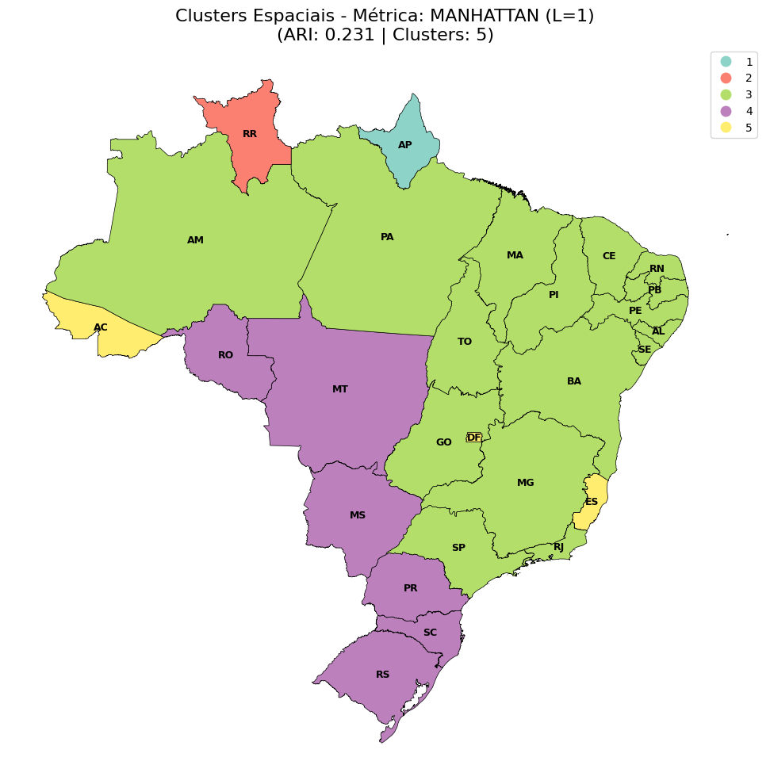
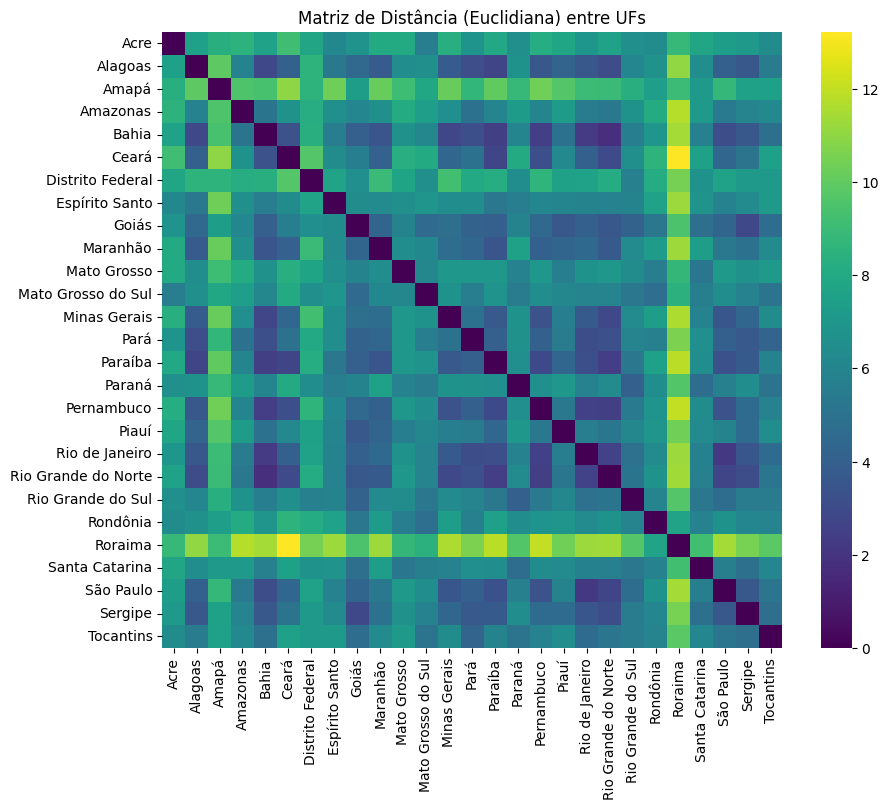
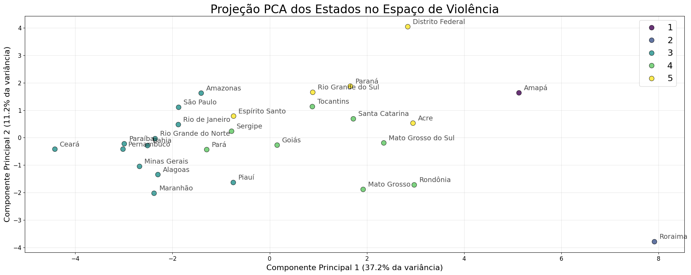
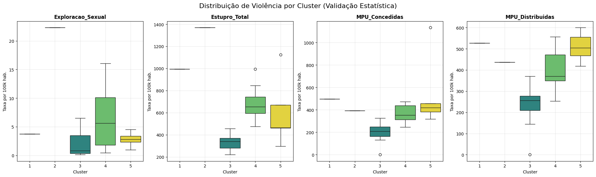

<h1 align="center">
    📊 Violência e Feminicídio no Brasil: Uma Abordagem Matemática
</h1>

  Este projeto aplica conceitos de Espaços Métricos e Álgebra Linear para analisar padrões de violência contra a mulher no Brasil, utilizando diferentes algoritmos de agrupamento para identificar clusterizações socioculturais.

  
  
  

  
    &nbsp;
  

---

# 📄 Descrição do Projeto

Este projeto foi desenvolvido no âmbito da disciplina de **Espaços Normados** na Ilum Escola de Ciência (CNPEM). O objetivo central é investigar se a violência de gênero no Brasil respeita as fronteiras geográficas tradicionais ou se segue uma dinâmica territorial própria.

Tratando cada Unidade Federativa (UF) como um vetor em um espaço multidimensional ($\mathbb{R}^{22}$), utilizamos dados do **Anuário Brasileiro de Segurança Pública** para calcular distâncias matemáticas entre os estados. Através de algoritmos de **Agrupamento Hierárquico** e de **Fuzzy C-Means**, buscamos identificar "regiões culturais da violência" e compará-las com a divisão regional oficial do IBGE.

# 📁 Acesso e Utilização

**Você pode acessar o código fonte baixando o notebook principal deste repositório.**

### Como executar:
1.  **Dependências:** Certifique-se de ter o Python instalado junto com as bibliotecas listadas abaixo.
2.  **Pré-processamento:** Execute as células iniciais para carregar o dataset, realizar a normalização populacional e a padronização (Z-score).
3.  **Clusterização:** O código calculará as matrizes de distância (Manhattan, Euclidiana, Minkowski) e gerará os Dendrogramas.
4.  **Análise:** As células finais geram os Boxplots e a projeção PCA para validação dos clusters.

**Estrutura do Repositório:**
- **`agrupamento_hierarquico.ipynb`**: Notebook com o algoritmo de Agrupamento Hierárquico, contendo toda a lógica de ETL, matemática e plotagem.
- **`Fuzzy C-Means Clustering.ipynb`**: Notebook com o algoritmo de Fuzzy C-Means, contendo toda a lógica de ETL, matemática e plotagem.
- **`imagens/`**: Pasta contendo os dendrogramas, mapas coloridos por cluster e matrizes de distância.
- **`dados/`**: Contém a base de dados bruta extraída do Anuário.

# ⚙️ Funcionalidades e Metodologia

- **`Engenharia de Atributos`**: 
  - **Normalização Demográfica**: Conversão de valores absolutos para taxas por 100 mil habitantes ($x'_{ij}$).
  - **Padronização (Z-Score)**: Ajuste para média 0 e desvio padrão 1, evitando que crimes mais frequentes dominem a métrica.
  
- **`Modelagem Matemática (Métricas)`**: 
  - Definição da distância entre estados $u$ e $v$ pela Família de Normas Minkowski ($L_p$):
    $$d_p(u, v) = \left( \sum_{k=1}^{n} |u_k - v_k|^p \right)^{1/p}$$
  - **Topologias Testadas**:
    - $p=1$: Distância de Manhattan.
    - $p=2$: Distância Euclidiana.
    - $p=3$: Minkowski Cúbica.
   
- **`Algoritmos de Machine Learning`**: 
  - **Hierarchical Clustering**: Método aglomerativo utilizando o critério *Average Linkage* (scipy.cluster.hierarchy).
  - **Fuzzy C-Means Clustering**: Método aglomerativo realizado após a aplicação de PCA nos dados (fcmeans.FCM)
  - **Validação**: Cálculo do *Adjusted Rand Index* (ARI) para comparar os clusters matemáticos com as regiões oficiais (Norte, Sul, etc.).

# 🎥 Demonstração dos Resultados

***Dendrogramas e Clusterização Espacial:***
*Abaixo, o mapa representativo da clusterização para a métrica Manhattan. Nota-se que Roraima e Amapá se isolam como outliers. Mais mapas podem ser vistos em [imagens](https://github.com/Caiomld/Agrupamento-Hierarquico/tree/main/imagens).

***Matrizes de Distância:***
*Visualização (Heatmap) da dissimilaridade entre cada par de estados para a métrica Euclidiana. Cores mais escuras indicam maior proximidade cultural/criminal. Mais matrizes podem ser vistas em [imagens](https://github.com/Caiomld/Agrupamento-Hierarquico/tree/main/imagens)*

 

***Análise de Atributos (PCA e Boxplot):***
*A projeção PCA (a) mostra a dispersão dos estados, enquanto os Boxplots (b) revelam que "Exploração Sexual" e "MPU Distribuídas" são os fatores determinantes para os agrupamentos.*

]

# 🖥️ Ferramentas Utilizadas
- **Jupyter Notebook**: Ambiente de desenvolvimento.
- **Bibliotecas**:
    - **Pandas**: Manipulação e limpeza da base de dados.
    - **NumPy**: Álgebra linear e cálculo vetorial.
    - **Scikit-learn**: Algoritmos de clusterização, PCA e métricas de validação (ARI).
    - **Matplotlib / Seaborn**: Visualização de dados (Dendrogramas, Heatmaps).
    - **Geopandas**: Plotagem dos mapas do Brasil.

# 🔎 Referências Principais
- **Anuário Brasileiro de Segurança Pública**: Fonte primária dos dados criminais.
- **IBGE**: Dados populacionais para normalização.
- **Métricas de Distância**: *Overview of Agglomerative Hierarchical Clustering Methods* (Oti Eric U. et al.).

# 👨‍💻 Desenvolvedores

| [Ana Luz P. Mendes ](https://github.com/LuzMendes) |  [Caio M. Leão Dantas ](https://github.com/Caiomld) |  [Enzo J. Xavier ](https://github.com/EnzoJanuzzi) |
| :---: | :---: | :---: |
